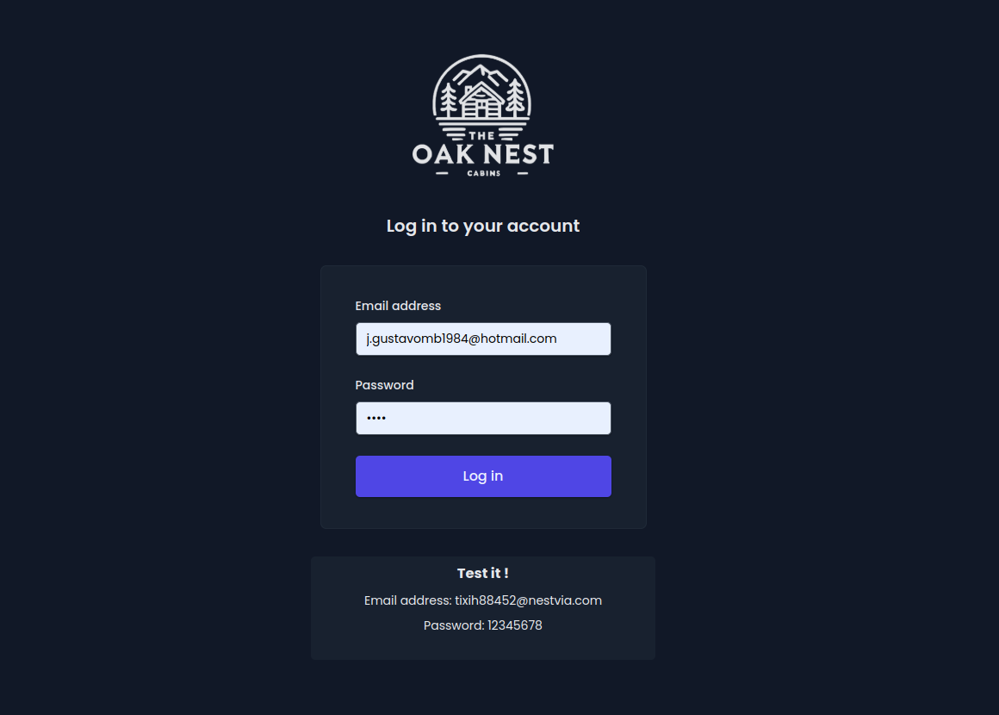
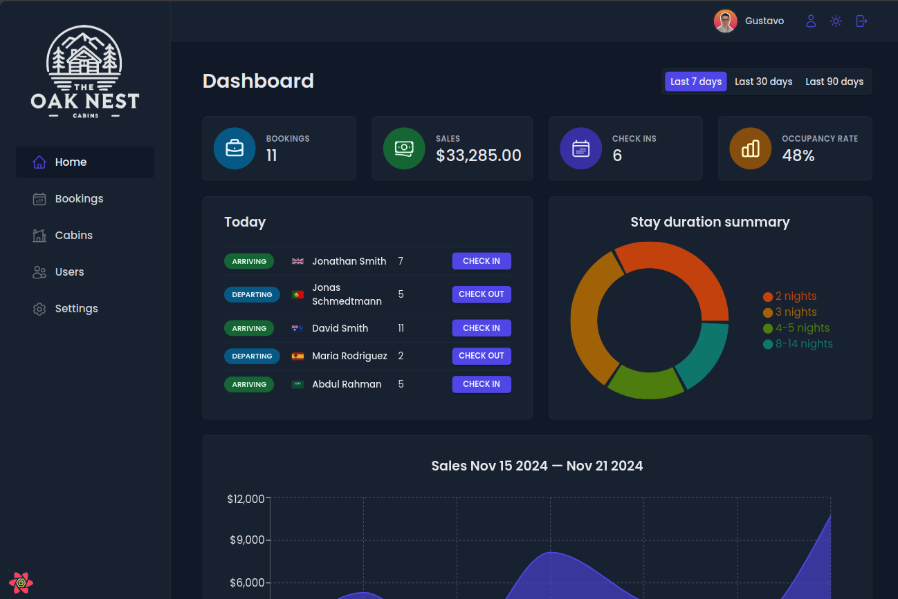
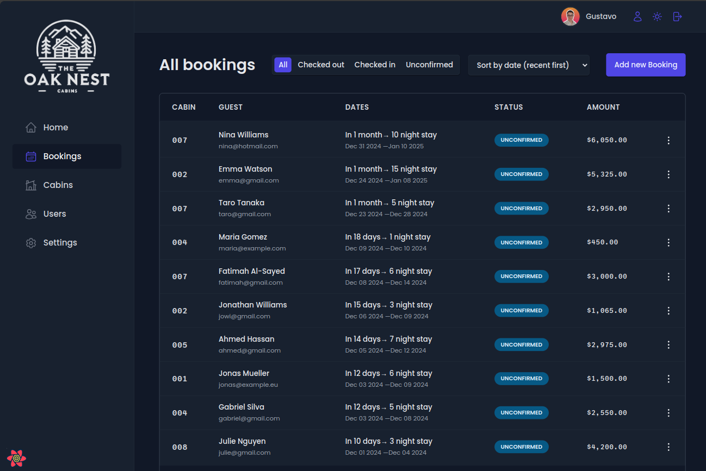
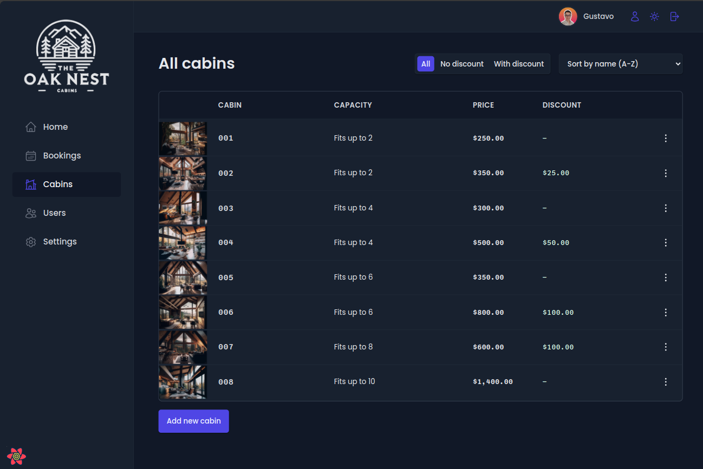
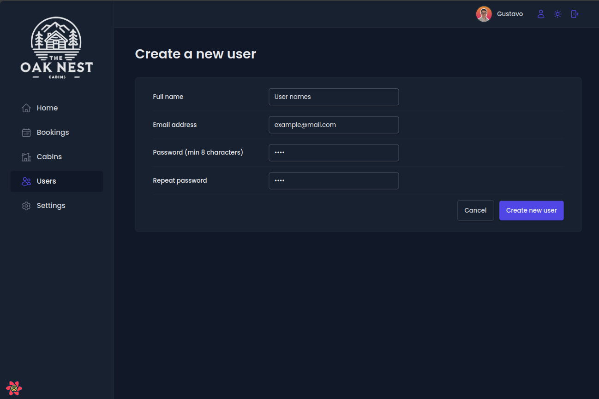
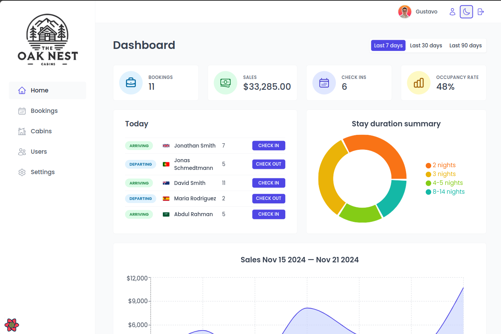

# The Oak Nest

**The Oak Nest** is a web application designed for rental cabin owners, providing a convenient platform to manage their properties and reservations. The **end users** of this application will be **The Oak Nest employees**, facilitating efficient management of daily operations.

## Features

- **Dashboard**
Overview of active cabins and reservations.

- **Booking System**
Organization of cabin reservations and availability.

- **Cabin Management**
Tool to add, edit or delete cabins in the system.

- **User Management**
Access control and management of employee profiles.

- **Day and Night Mode**
Display options to customize the user experience.

